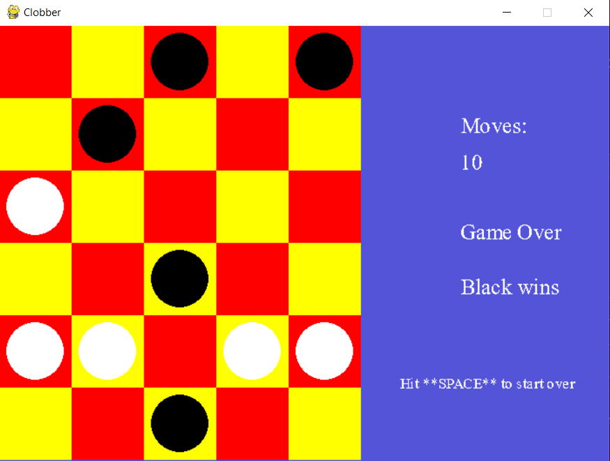

# Clobber_Game
Final Project for AI university course 
Visualized by Pygame library
 

 

Steps For Instalation: 
1) add dependencies:  
<code>pip install pygame==2.0.1</code> 
2) run python with below descriptions 
<code>python clobber.py dim1 dim2 opt</code> 
dim1 = num of rows between [1 to 25] 
dim2 = num of cols between[2 to 25] 
opt = 1: comp will choose to clobber a stone from the largest connected component of white stones 
opt = 2: comp will choose to clobber a stone from the smallest connected component of white stones 
opt = 3: comp will randomly choose a white stone to clobber 
default: 6x5 board, opt = 1
 

<pre>
for run on windows as .exe file follow below steps:
1) go to dist directory
2) double click on clobber.exe
3) Done!
</pre>
